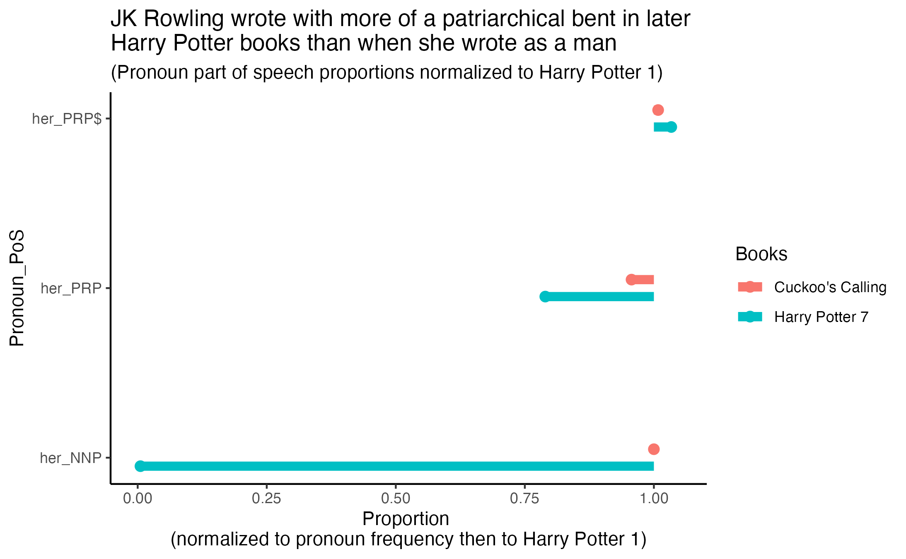

# Introduction 
Compare JK Rowling's object and subject frequencies for feminine and masculine personal pronouns when she is writing as herself or her pseudonym, Robert Galbraith.  

# Methodology
- Gather text files from the books in question.
- Use only a comparable number of lines from each book by normalizing to reading level (using their Flesch Reading Scores).
- Use SparkNLP to find the parts of speech for each word in the lines fed to it.
- Clean datasets and normalize to both the frequency of each pronoun and the baseline book's (Harry Potter and the Sorcerer's Stone) proportion of pronoun part of speech categorization.  

# Hypothesis
I hypothesize that JK Rowling wrote with more patriarchal object and subject frequencies both when she was writing as a male and as time progressed.

# Evaluation
1. Download comparable number of words between her Harry Potter series and books by "Robert Galbraith" 
    - Find PDFs
        - ["The Cuckoo's Calling"¹](https://worldfabibooks.wordpress.com/wp-content/uploads/2013/10/the-cuckoo_s-calling-robert-galbraith-j-k-rowling.pdf)
            - Use only pre-2013 Robert Galbraith books because that is when JK Rowling's pseudonym became common knowledge.⁵
            - Download pgs 7-384
            - Use [PDF Agile⁶](https://www.pdfagile.com/online/pdf-to-txt) to convert to txt
            - Find line count ("wc -l cuckoos_calling_text.txt") = 16373
        - ["Harry Potter and the Sorcerer's Stone"³](https://docenti.unimc.it/antonella.pascali/teaching/2018/19055/files/ultima-lezione/harry-potter-and-the-philosophers-stone)
            - Use this one as standard to compare others to
            - Download 2-250
            - Repeat steps above
            - Line count = 11113
        - ["Harry Potter and the Deathly Hallows"⁴](https://vidyaprabodhinicollege.edu.in/VPCCECM/ebooks/ENGLISH%20LITERATURE/Harry%20potter/(Book%207)%20Harry%20Potter%20And%20The%20Deathly%20Hallows.pdf)
            - Choose this one because closest in time to release date of Cuckoo's Calling
            - Download 7-767
            - Repeat steps above
            - Line count = 24320
    - Use Flesch Reading Score to determine reading level
        - (Reading level is given on a linear scale of 1-100, so it will be easy to adjust line count later.⁷)
        - [Readability Scoring System²](https://readabilityformulas.com/readability-scoring-system.php)
        - Uploaded txt files, which reduces each to 3500 words
        - Process random sample
        - Repeated 3x, found average 
            - Cuckoo's Calling = 66.67 (avg)
                - 59 (test 1)
                - 64 (test 2)
                - 77 (test 3)
            - HP1 = 81.33 (avg)
                - 79 (test 1)
                - 87 (test 2)
                - 78 (test 3)
            - HP7 = 76 (avg)
                - 77 (test 1)
                - 76 (test 2)
                - 75 (test 3)
    - Standard scale by adjusting for number of words in proportion to reading level
        - Normalize to "Cuckoo's Calling"
            - Use only 7500 lines so that don't have to use all of any of the books
            - So normalize 66.67 reading level to 7,500 lines
        - HP1
            - 66.67/7,500 = 81.33/x
            - x = 9,149 lines
        - HP7 
            - 66.67/7,500 = 76/x
            - x = 8,550 lines
2. SparkNLP and PoS
    - Randomize the lines chosen using random.sample()
    - Set seed so it is reproducible
    - Find parts of speech for the given lines
3. Cleaning and "Statistics"
    - Filter for just pronouns
    - Make a dataframe for their frequencies
    - Normalize first to the number of each pronoun used 
        - ex: If "her" was labeled as a PRP 50 times and PRP$ 300 times, then the new values become [50/(50+300)] and [300/(50+300)], respectively.
    - Combine with the other books into one datafame
    - Then normalize to the baseline, "Harry Potter and the Sorcerer's Stone"
    - Eliminate all pronouns where there wasn't a difference across books (where the normalized value is 1.0 for each book).

    - NOTE: Cannot do statistics since only have one result from each condition (eliminating potential tests such as t tests, proportion z tests, tukey, anova, etc) and since it would not be accurate to use count data (eliminating chisq test of homogeneity).
        - Have to use proportion data rather than count data since (1) there are an unequal number of words used and (2) there are far more male characters than female, so the usage would be much higher for traditionally male pronouns and skew the results.

# Conclusion
When I reduced my dataset to just the pronoun-part of speech groupings that showed a difference from the frequencies in Harry Potter 1, I was left with three: "her-PRP$", "her_PRP", and "her-NNP." PRP$ is the abbreviation for a possessive pronoun; PRP, personal pronoun; and NNP, proper noun.

I plotted these three for both books (Cuckoo's Calling and Harry Potter 7) as a barbell plot to easily see which proportions depicted a drop or an increase in frequency.

I was surprised for many reasons. One, JK Rowling's writing under her male pseudonym did not change the frequencies of her pronoun parts of speech in comparison to her first Harry Potter book fifteen years earlier. Instead, her seventh and final Harry Potter book, written ten years after the first, reflected much more "patriarchal" subject and object frequencies. The plot shows that the assigned usage of "her" increased as a possessive pronoun and decreased as a personal pronoun. Even more dramatically, the usage of "her" as a proper noun dropped nearly completely. It is quite notable these same changes were not seen for the corresponding traditional male pronouns.

Second, I was surprised that "her" was the only pronoun to see a change across books. At the very least, I expected to witness similar changes in "hers." At most, I thought there may have been opposing changes in the corresponding "him" and "his" pronouns. This may be due to the fact that there are two male-gendered pronouns ("him" and "his") for two separate meanings whereas there is only one female-gendered pronoun for both usages ("her").

Finally, I was surprised that only the *same* three pronoun-part of speech groupings differed across books. I expected that there may have been some changes in one book that wouldn't be present in another. However, the results show that only "her-PRP$", "her_PRP", and "her-NNP" depicted changes- again supporting the conclusion from the above paragraph and suggesting some patriarchal influence in JK Rowling's writing.

Since these changes occured only for traditional female pronouns in only the final Harry Potter book (which was written before Cuckoo's Calling), it is reasonable to conclude that fame may have subconciously influenced JK Rowling to write in a manner more aligned with culture's expectations- a pressure that wasn't present years later while writing under a pseudonym, even an assumed male pseudonym.

# Works Cited
1. Galbraith, R. (2013) *The Cuckoo's Calling.* Sphere/Little, Brown Book Group. https://worldfabibooks.wordpress.com/wp-content/uploads/2013/10/the-cuckoo_s-calling-robert-galbraith-j-k-rowling.pdf
2. Readability Scoring System. https://readabilityformulas.com/readability-scoring-system.php
3. Rowling, JK. (1997). *Harry Potter and the Sorcerer's Stone.* Bloomsbury Publishing. https://docenti.unimc.it/antonella.pascali/teaching/2018/19055/files/ultima-lezione/harry-potter-and-the-philosophers-stone
4. Rowling, JK. (2007). *Harry Potter and the Deathly Hallows.* Bloomsbury Publishing. https://vidyaprabodhinicollege.edu.in/VPCCECM/ebooks/ENGLISH%20LITERATURE/Harry%20potter/(Book%207)%20Harry%20Potter%20And%20The%20Deathly%20Hallows.pdf
5. NPR. (2015, November 2). *J.K. Rowling On Her Nom De Plume Robert Galbraith* NPR. https://www.npr.org/2015/11/02/453885684/j-k-rolling-on-her-nom-de-plume-robert-galbraith#:~:text=She%20was%20outed%20back%20in,very%20real%20person%20to%20me.
6. PDFAgile. https://www.pdfagile.com/online/pdf-to-txt
7. van de Rakt, M. (2019, May 20). *The Flesch reading ease score: why and how to use it.* Yoast. https://yoast.com/flesch-reading-ease-score/#:~:text=What%20is%20the%20Flesch%20reading,easy%20to%20read